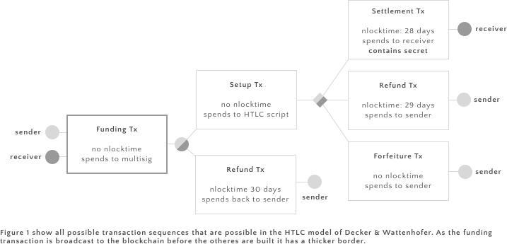

# Decker & Wattenhofer HTLCs

Decker & Wattenhofer solve the problem by setting up two levels of transactions on top of the funding transaction of a payment channel. The first level is a *setup transaction* that spends the 2-of-2 multisig output of the funding transaction into a second 2-of-2 multisig. The output script of the setup transaction specifies that 

> either the receiver provides the secret and a valid signature from both parties, or both parties must sign the transaction spending the HTLC output.

In Bitcoin script the is:

	OP_IF
		OP HASH160 <Hash160 (s)> OP_EQUALVERIFY 2
		<sender> <receiver> OP_CHECKMULTISIG
	OP_ELSE
		2 <sender> <receiver> OP_CHECKMULTISIG 
	OP_ENDIF
	
The setup transaction is signed & exchanged by both parties, but not broadcast to the bitcon network.

During the execution of the protocol a second level of transactions is created that spend the output of the setup transaction. This level consists of up to three transactions that may claim the output of the setup transaction: 

* The *settlement transaction* performs the transfer from sender to receiver if receiver reveals the secret. This transaction has a timelock that is a bit smaller than the one of the refund transaction. It uses the if-brance of the output of the setup transaction.
* The *refund transaction* ensures that sender is refunded should receiver not cooperate. This transaction has a timelock that is equal to the timeconstraint in the HTLC. 
* Finally, the *forfeiture transaction* is used to guarantee that sender is refunded if receiver failes to present the secret. It has no timelock. The latter two transactions both use the else-branch of the output script of the setup transaction.

There are three possible scenarios: If the receiver does not cooperate, the sender can eventually use the refund transaction to get a refund and close the channel. Should the receiver be able to produce the secret, he can use the settlement transaction to settle the payment. Finally in case the receiver fails to get ahold of the secret, the parties can cooperate and use the forfeiture transaction to refund the payment in question back to sender but keep the channel open.

