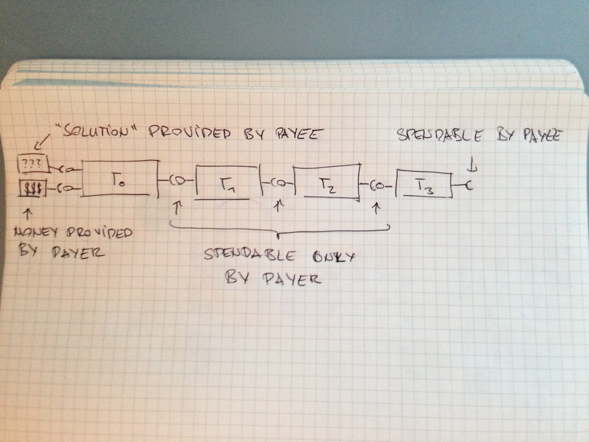

## Preliminaries

### Bitcoin script

Bitcoin script is a Forth like language with a relatively rich set of instructions called op-codes. Data can be stored on two stacks and the op-codes can access the stack and alter it through the usual stack operations push and pop.

We will consider a restricted version of Bitcoin script called *mini Bitcoin script* that only has four op-codes:

* PUSH arg: pushes arg onto the stack
* POP: pops the top element from the stack or throws an error if the stack is empty
* EQUAL: pops the top two stack items from the stack, checks if they are equal and pushes the result to the stack; throws an error if the stack is smaller than 2.
* IF ... ELSE ...ENDIF: checks if the top stack element is true, executed the IF branch in that case and the ELSE branch otherwise

A script evaluates to true if it can be executed without an error and *true* is the top element of the first stack.

We will show below that *mini Bitcoin script* is essentially turing complete. We will define what we mean by "essentially" below. As mini Bitcoin script is a restriction of Bitcoin script it follows that Bitcoin script is essentially turing complete.

Bitcoin script is executed when miners add new transactions to the blockchain. A transactions is a data structure with a set of input scripts and a set of output scripts. A transaction *t1* with input script *in1* can *spend* an output of a transaction *t0* with output script *out0* if

*in1 out0*

evaluates to true. Every output of a transaction can be spend exactly once, and is associated with a number of Bitcoins. Creating a transaction that spends an output is akin to moving Bitcoins. Having the ability to create a transaction to spend an output is akin to holding Bitcoins.

In order to enforce that an output can be spent only once, the blockchain asigns a total order on all transactions. If two transactions spend the same output, the first one under this order will be considered valid and the second invalid.

### Formal Languages

A *word* is a sequence of symbols like *abab* or *aaa*. A *formal language* is a set of words. Examples of formal languages are the language consisting only of the three words *{abab, ababab, abcdef}*, the language "even" consisting of all  words of even length, or the language "addition" containing all triples *(x,y,z)* such that *z=x+y*.

#### Deciding a language

An automaton *decides* a language if given a word, it can compute whether that word is in the language. Deciding a language requires computation, for example given *(x,y,z)* one has to compute whether x+y=z to determine whether *(x,y,z)* is in the "addition" language described above.

## Formal Languages in Bitcoin script

Let *t1, t2, t3, ...* be a sequence of transactions, each with a single input and a single output. We call such a sequence a *transaction chain* if the output of *ti* is spent by the input of *ti+1*. We denote the input script of *ti* by *ini* and it's output script by *outi*.

The scripts are evaluated in the following order

in1 out0 | in2 out1 | in2 out1 | in2 out1 | ...

The vertical bars "|" illustrate the fact that the stack is cleared after evaluating the output scripts.

### Deciding a language in Bitcoin script

We will say that chain *t0, t1, t3, ..., tn* checks a word *w* iff *t0* puts *w* onto the stack. A *chain generator* is a function *g* that gets a word *w* as an input and produces a transaction chain *g(w)* that checks that word. A chain generator is *efficient* if it can be computed in polynomial time (that is formal language speak for fast).

_ **Definition.** A language is *decidable in bitcoin script* if there is an efficient chain generator *g* such that a word *w* is in the language if and only if the last output of *g(w)* is spendable._

Note that as *g* is efficient it cannot decide any computable language. *g* just provides an "outer loop" to the bitcoin scripting language.

### Example: Accepting the language "even"

To accept the word *aa* we a chain generator must produce a sequence of transactions *t0, t1, t2, t3* such that:

 * *in1*: Push the *aa* onto the "word stack" and "even" onto the "state stack".
 * *out0*: Check that *aa* is on the word stack and that "even" is on the state stack

At this point the stacks are reset.

 * *in2*: Push the *a* onto the "word stack" and "odd" onto the "state stack".
 * *out1*: Check that *a* is on the word stack and that "odd" is on the state stack

At this point the stacks are reset.

 * *in3*: Push the nothing onto the "word stack" and "even" onto the "state stack".
 * *out2*: Check that the word stack is empty and that "even" is on the state stack. Make this output spendable by the payee.

### Example: Accepting the language of well nested parentheses

In the example above we have not really made use of the stack. We've just used one stack to store the input word and the other to store a state. Note that our operations on these stacks have been trivila: we've just consumed the input word from left to right and the state stack has always had exactly one element on it.

## Turing completeness of Bitcoin scripting

We will show that any turing machine can be simulated by a Bitcoin script. Essentially what we are doing is that we compile the turing machine into Bitcoin script. This compilation process shows that every language that can be decided by a Turing machine can be decided in Bitcoin script. Therefore

_ **Theorem.** Bitcoin script is essentially Turing complete._

Our compilation process with move through two intermidiary formalisms: two stack pushdown automata and Bticoin Script4 which is Bitcoin script with four stacks.

The next section defined the Turing machines and two stack automata that are needed in the proof. The proof of the Theorem is in the subsequent section.

### Turing machines and pushdown automata

Turing machines where invented to formalize what calculations can be made by a person with a pen and an infinite supply of paper. Note that this person can write on the paper, and his decision for what to write can be informed by reading from the paper. This concept can be formalized as follows:

_ **Definition.** A Turing machine is machine with a finite amount of internal storage and a read-write head. This head is on an infinite band (the paper) that can be written to or read from. It also has a finite set of instructions of the form: If your internal storage is *q* and the symbol under the read-write head is *a*, then move the head by one position or stay, and write a symbol.
_

An input word is presented to a turing machine on a separate band that the turing machine can consume from left to right

## Smart contracts

We need a system that scans the blockchain to find a transaction with output *out0*. If such a transaction appears, an efficient generator pushes transactions *t1, t2, t3* to the blockchain with the scripts above.

The outputs of transactions *t0, t1, t2* are spendable only by the payer, while the last transaction is spendable by the payee.

The above construction can be used to build a smart contract as follows:

