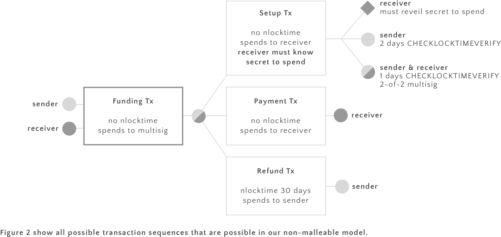

# How to build a bitcoin micropayment network today
(Draft 0.2)

We describe how a network of micropayment channels can be built using features that are available in bitcoin today.

## Unidirectional payment Channels

We use standard uni-directional payment channels. The construction is as usual. We use channels where the refund transaction has an nlocktime set to some point in the future (say 30 days). The payment transactions do not have an nlocktime set.

### nlocktime of a channel

Note that the nlocktime of the refund transaction forces the receiver to broadcast a payment transaction before the nlocktime of the refund transaction expires. If he fails to do that he looses all payments obtained through the channel.

Consider for example a refund transaction with nlocktime set to 30 days. Now receiver gets a payment transaction of 0.1. The contract on that payment transaction can be read as 
> Receiver will get 0.1 bitcoin if he closes the channel within 30 days.

Thus we define the *nlocktime of a channel* to be the nlocktime of its refund transaction. We will use this observation to encode HTLC below. We next show that the nlocktime of a channel can both be increased and decreased.

### Decreasing nlocktime of a channel

Note that the nlocktime of a payment channel can easily be decreased if both parties agree to do so: the easiest way to do this is for receiver the build a transaction that is identical with the original refund transaction just with a lower nlocktime. He then sends this transaction to receiver.

### Increasing nlocktime of a channel

Conversely, it is also possible to increase the nlocktime of a channel if both parties cooperate, but an additional transaction fee must be payed. To do this the two parties 

* set up a new 2-of-2 multisig address, 
* they build and sign a new refund transaction from the new multisig address with a higher nlocktime, and
* broadcast a transaction to the blockchain that spends the funds from the old multisig to the new one. 

This way the input to the new refund address is spent, thus invalidating the old refund transaction.

# Background on HTLCs

HTLCs are cryptographic contracts with both a time constraint and a constraint that requires receiver to know a secret. An example HTLC is the following:

> Receiver can unlock this output if he can present the secret within the next two days. 

The problem with expressing this in bitcoin script is the condition "within two days". While it is easy to express "after two days" using nlocktime, we have to jump through some hoops to express "before two days".

### Decker & Wattenhofer HTLCs

Decker & Wattenhofer solve the problem by setting up two levels of transactions on top of the funding transaction of a payment channel. The first level is a *setup transaction* that spends the 2-of-2 multisig output of the funding transaction into a second 2-of-2 multisig. The output script of the setup transaction specifies that 

> either the receiver provides the secret and a valid signature from both parties, or both parties must sign the transaction spending the HTLC output.

In Bitcoin script the is:

	OP_IF
		OP HASH160 <Hash160 (s)> OP_EQUALVERIFY 2
		<sender> <receiver> OP_CHECKMULTISIG
	OP_ELSE
		2 <sender> <receiver> OP_CHECKMULTISIG 
	OP_ENDIF
	
The setup transaction is signed & exchanged by both parties, but not broadcast to the bitcon network.

During the execution of the protocol a second level of transactions is created that spend the output of the setup transaction. This level consists of up to three transactions that may claim the output of the setup transaction: 

* The *settlement transaction* performs the transfer from sender to receiver if receiver reveals the secret. This transaction has a timelock that is a bit smaller than the one of the refund transaction. It uses the if-brance of the output of the setup transaction.
* The *refund transaction* ensures that sender is refunded should receiver not cooperate. This transaction has a timelock that is equal to the timeconstraint in the HTLC. 
* Finally, the *forfeiture transaction* is used to guarantee that sender is refunded if receiver failes to present the secret. It has no timelock. The latter two transactions both use the else-branch of the output script of the setup transaction.

There are three possible scenarios: If the receiver does not cooperate, the sender can eventually use the refund transaction to get a refund and close the channel. Should the receiver be able to produce the secret, he can use the settlement transaction to settle the payment. Finally in case the receiver fails to get ahold of the secret, the parties can cooperate and use the forfeiture transaction to refund the payment in question back to sender but keep the channel open.

### Poon & Dryja HTLCs

[Internal note: My feeling is that these are pretty similar to the ones described above, but I still cannot make it through the entire construction. They certainly are subject to malleability as their construction also consists of at least two levels of un-broadcasted transactions on top of the (broadcasted) funding transaction (see for example page 34 of [2].]

## Non malleable HTLCs

We now describe an new implementation of HTLCs that is not subject to transaction malleability. 

Recall that the challenge in building HTLC is to force receiver to reveal his secret within a limited amount of time. Decker & Wattenhofer solve this problem by giving sender a refund transaction that he can use to force Receiver to reveal his secret on time. However, this refund transaction spends the output if the unbroadcasted Setup Transaction, and was thus subject to a malleability attack.

We solve the same problem in a different way using OP_CHECKLOCKTIMEVERIFY. Our construction is similar to the one by Decker & Wattenhofer, but the output script of our Setup transaction has three branches and encodes the following condition

> Receiver can spend this output if he can present the secret. However, if he fails to do so within two days, Receiver can spend the output. Finally, both parties can cooperate at any time to spend the output jointly.

The picture below shows the transactions that can be exchanged by the two parties. Note that all broadcasted transaction only depend only on the funding transaction that has been broadcast and confirmed into the blockchain. This is the reason that our approach is not vulnerable to transaction malleability.

The output of the setup transaction can be encoded in Bitcoin script as follows:

	OP_IF
		<Receiver's pubkey> CHECKSIGVERIFY
		OP HASH160 <Hash160 (s)> OP_EQUALVERIFY 
	OP_ELSE
		<2 day> CHECKSEQUENCEVERIFY DROP
		<Sender's pubkey> CHECKSIGVERIFY
	OP_ENDIF
	
There are two ways of spending from this an output generated by this script. The if branch can be spent by receiver if he can provide the secret. Receiver can do so immediately

	<secret> <Receiver's sig> <Receiver's pubkey> 1

After two days, sender can spend the output using the else branch:

	<Senders's sig> <Sender's pubkey> 0

An important property of our construction is: 

**Theorem** Assume that the Funding transaction has been confirmed into the blockchain and that both parties have signed and exchanged the Setup and Refund transactions. If Sender and Receiver are malicious but rational, exactly one of the following is true:

 * Receiver reveals the secret to Sender within two days and Sender sends the money to Receiver
 * Sender gets a refund after two days

**Proof** There are two ways that this can play out: either the two parties decide to cooperate or not. We will see that under the assumptions they will cooperate. To see why, we have to look at what happens if they don't.

In this case eventually one party will broadcast the Setup transaction to the blockchain. There are two cases now: If Receiver spends the output of the Setup transaction, then he reveals his secret. If he does not then Sender will be able to spend output after two days to refund to himself (these two cases are exactly what is enforced by the output of the Setup transaction).

This outcome is not bad for either party, no-one has lost any money. It's not awesome either because they are effectively closing the channel when they broadcast the Setup transaction. Everything else being equal, they prefer to keep the channel open.

We have just argued that no party has anything to gain from not cooperating. So lets see how they can cooperate to avoid having to close channel. The protocol is simple:

1. After getting the signed Setup transaction, Receiver sends the secret to sender
2. Sender signs a payment transaction that spends the amount of the micropayment to Receiver and sends it to him

We have to check that the conditions of the Theorem are maintained at all points in this protocol.

After step one Receiver waits for Sender to send the payment transaction for one day. If he does not get it he proceeds to broadcast the Setup transaction and a transaction that spends its output to himself, thereby revealing the secret. In this case everything played out as in the non-cooperative case. 

Note that it might seem that Sender has an advantage after step one. After all, he has received the secret that proves that he payed. However, Sender cannot get a refund at this point: the branch of the Setup transaction that Sender can spend is blocked with a 2-day CHECKSEQUENCEVERIFY lock. If Sender broadcasts the Setup transaction Receiver will notice and have two days to spend the output himself. 

After step two Sender does not gained any more advantages. Receiver however now has two ways of getting the micropayment: via the the setup transaction or via the payment transaction. However he can only use one of them because they spend the same output. He will prefer to use the payment transaction because it allows him to keep the channel open. **qed.**

### Why we need CSV

The proof would break at the very end if we use CLTV instead CSV: Sender could just wait for the end of the cooperative protocoll and a further two days until the lock of her output of the Setup transaction gets lifted. Sender then quickly broadcasts the setup transaction and spends from it. As there is no time delay between the two Receiver cannot prevent that. In this case Sender has received the secret and gotten a refund, violating the Theorem. HTLC are not trustless in this case anymore.

<!--
### Downgrading HTLC to normal payments

Note that the receiver is forced to spend the output of the HTLC transaction before the nlocktime of the refund transaction expires. However, he can choose to share the secret with sender earlier. In return, and on a completely voluntary basis, the receiver might offer to downgrade the HTLC transaction to a normal payment transaction. To do so he simply sends a signed payment transaction to a receiver with the same amount as the HTLC transaction.

Note that neither party is forced to cooperate in this manner, but as the balance is not changed, they surely will not mind. However, doing this helps both parties to keep transaction sizes (and hence fees) small.
-->
### The problem of receivers not online

There are two timelocks to worry about. First there is the nlocktime of the refund transaction. This might be a bit of a problem (note that the receiver cannot send the fully signed payments back to the hub; the hub could spend an old payment to scam the receiver and would not be trustless anymore). We have to look at channels that do not expire after a fixed amount of time here and will need CHECKSEQUENCEVERIFY for that for sure.

The other is the CHECKSEQUENCEVERIFY constraint on the output of the setup transaction. This might be less critical that the other one. Note that Receiver will only have to broadcast the Setup transaction if Sender is not cooperative. However, the hub is the sender and will always be cooperative. Thus the only case we'd need to worry about is when a user is not cooperative (that is he messes with the client software). If a user does that and misses a payment, we'll that's his own fault imo.. (more analysis is needed here)

### Chaining HTLC channels

Consider the case where Alice routes a payment for Carol through Bob
    
    Alice -> Bob -> Carol
    
For HTLCs to be effective, it is important that nlocktimes are decreasing along the route. We have shown above that the nlocktime of a channel can both be increased and decreased. If the nlocktimes along the route are not decreasing, then the parties will negotiate that either 

* the nlocktime of  the channel from Alice to Bob be decreased or
* the nlocktime of the channel from Bob to Carol be increased.

### Keeping track of multiple secrets

Consider the case where Alice routes a payments through Bob to Carol. Assume that Carol has neither spent the HTLC transaction nor has revealed her secret via a downgrade.

	                Carol
	              /
    Alice -> Bob
	              \
	                Dave

Now Alice might want to route a second payment, again through Bob, but this time to Dave. In this case her channel to Bob must keep track of two hashed secrets. This can be accomplished by adding a seconds output to her HTLC transaction shared with Bob.

The above example shows why it is important for all parties to downgrade their transactions as fast as possible.

### What hacks are possibel white CHECKSEQUENCEVERIFY is a no op

TODO

## References 

[1] [A Fast and Scalable Payment Network with
Bitcoin Duplex Micropayment Channels](http://diyhpl.us/~bryan/papers2/bitcoin/Fast%20and%20scalable%20payment%20network%20with%20Bitcoin%20duplex%20micropayment%20channels.pdf) by Christian Decker and Roger Wattenhofer