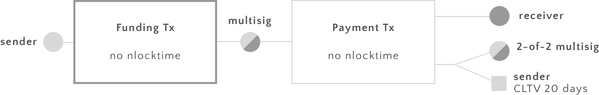

# How to build a bitcoin micropayment network today
(Draft 0.2)

We describe how a network of micropayment channels can be built. Our construction is not vulnerable to malleability and only uses constructs that are available today. We also show how our construction can easily upgraded once CSV gets deployed to have nicer properties such as payment channels that do not expire. 

# Time-limited uni-directional payment channels

The idea is that Sender sends payments to Receiver that get progressively better for Receiver. However Sender will try to cheat and broadcast an old transaction to the blockchain in which he spends less money. We set up a system in which such an attempt in cheating is punishable by Receiver by not only getting all legitimate payments up to this point, but by allowing him to spend all coins locked up in the channel by Sender. To make sure that 

Sender wil construct and sign payment transactions of the form below and send to receiver. Sender will use a new private key to generate the multisig output of the Payment transaction every time he generates a new Payment transaction. Receiver will only accept a payment until 2 days before the CTLV timeout expires (day 18 in the example below).

When a new payment is made, it is necessary to invalidate the last one. The reason is that sender will want to broadcast an old payment transaction bc he spends less money on the old ones.

To do that sender will share the old key used to generate the last transaction with Receiver every time he sends a new payment.

Now assume that Sender broadcasts an old payment transaction to the blockchain. Receiver can notice when that happens by monitoring the blockchain. When that happens, Receiver can spend his output immediately. He can also spend Senders output because (a) he knows both private keys of the multisig address and (b) senders output is blocked for two days by the CSV constraint. 

Note that if Sender tries to cheat by broadcasting an old transaction he loses not only the funds he has legitimately sent to Receiver, but all also the funds that he has not spent yet.

### Closing the channel

There can be a protocoll for closing the channel immediately if both parties agree to do so. To do so Sender signes a payment trasnaction as above just without the CTLV constraint. In this case both parties can spend their money immediately. After the channel is closed, receiver can not accept any more payments.

## Removing the time-limit

We now show how the time limit can be lifted. However CSV is needed in this construction. The construction is almost identical. The only difference is that senders output is restricted by a CSV lock of 2 days instead of a CLTV lock of 20 days.

In this case Sender can accept payments indefinately, provided that the channel is still funded and that no 
