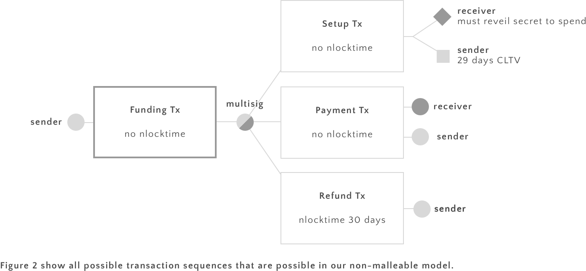

# How to build a bitcoin micropayment network today

We describe how a network of micropayment channels can be built. Our construction is not vulnerable to malleability and only uses constructs that are available today. We also show how our construction can easily upgraded once CSV gets deployed to have nicer properties such as payment channels that do not expire. 

## Uni-directional payment channels

Sender and receiver will sign and exchange payment transactions of the form below.

Both parties know slightly different versions of the payment transactions. Receiver builds the top Payment transaction, signs it, and sends it to Sender (so sender is the only one to know the fully signed transaction). Conversely, Sender builds the lower Payment transaction, signs it and sends it to Receiver. 

Receiver will only accept a payment until 2 days before the CTLV timeout expires (day 27 in the example above).

Sender will use a new private key to generate the multisig output of the Payment transaction every time he generates a new one. Whenever a new payment is created, Sender will share the key used in the old one.

This is necessary to prevent Sender from broadcasting an old payment transaction (note that the older payment transactions are of advantage to Sender since he will have to pay less). However, our construction prevents that from happening: Assume that Sender broadcasts an old transaction. Receiver can clearly claim the first output. The second branch of the second output is locked with a CLTV constrains, so Sender cannot spend this. However, Receiver can spend the second output as Sender has shared the key used in that transaction with him previously.

Note that if Sender tries to cheat by broadcasting an old transaction he loses not only the funds he has legitimately sent to Receiver, but all also the funds that he has not spent yet.

Our construction is inspired by Chapter 3 of [1]. 

### Closing the channel

There can be a protocol for closing the channel immediately if both parties agree to do so. To do so Sender signes a payment trasnaction as above just without the CTLV constraint. In this case both parties can spend their money immediately. After the channel is closed, receiver can not accept any more payments.

### Removing the time-limit

We simply replace the CLTV constraint by a CSV constraint in the output script of senders payment transaction.

In this case Sender can accept payments indefinitely, provided that the channel is still funded and that no 

## HTLCs

The challenge in building HTLCs is to encode the following condition using Bitcoin transactions:

> Receiver can spend an output if he can present a secret within a limited amount of time. If he fails to do so, no payment is made.

The picture below shows transactions that are exchanged by the two parties to ensure this condition is met: 

Note that the lower two payment transactions are exactly the same as in a payment channel described above. The output of the HTLC transaction can be encoded in Bitcoin script as follows:

	OP_IF
		<Receiver's pubkey> CHECKSIGVERIFY
		OP HASH160 <Hash160 (s)> OP_EQUALVERIFY 
	OP_ELSE
		<29 days> CHECKLOCKTIMEVERIFY DROP
		<Sender's pubkey> CHECKSIGVERIFY
	OP_ENDIF
	
There are two ways of spending from this an output generated by this script. The if-branch can be spent by receiver if he can provide the secret. Receiver can do so immediately

	<secret> <Receiver's sig> <Receiver's pubkey> 1

After 30 days, sender can spend the output using the else branch:

	<Senders's sig> <Sender's pubkey> 0

We will assume Sender and Receiver are malicious but rational (they care about their own best interest). 

*__Theorem__ If Sender and Receiver set up a HTLC as above, exactly one of the following is true:*

 * *Receiver reveals the secret to Sender within a limited amount of time and Sender sends him the money*
 * *Sender gets a refund after 29 days*

**Proof** We assume that the Funding transaction has been confirmed into the blockchain and both parties have signed and exchanged the HTLC transaction. There are two ways that this can play out: either the two parties decide to cooperate or not. We will see that under the assumptions they will cooperate. To see why, we have to look at what happens if they don't.

In this case eventually one party will broadcast the HTLC transaction to the blockchain and someone spends it. If Receiver does, then he reveals his secret while doing so. If Receiver does not spend, then Sender will be able to spend output after 29 days to refund himself (these two cases are exactly what is enforced by the output of the Setup transaction). In both cases the condition of the Theorem is maintained.

The outcome of not cooperating is not bad for either party, no-one has lost any money. However, it's not awesome either. After all, they are effectively closing the channel when someone broadcasts the HTLC transaction. All else being equal, they prefer to keep the channel open.

We have just argued that no party has anything to gain from not cooperating. So lets see how they can cooperate to avoid having to close channel. The protocol is simple:

1. After getting the signed HTLC transaction from Sender, Receiver sends the secret to sender
2. Sender signs a payment transaction that spends the amount of the micropayment to Receiver and sends it to him. Receiver replies with the payment transaction for Sender.

We have to check that the conditions of the Theorem are maintained after each step.

After step 1. Receiver waits for Sender to send the payment transaction for one day (this is not enforced by anything, just a convention between the two). If he does not get the payment he assumes that Sender is not willing to cooperate and proceeds to broadcast the HTLC transaction to the blockchain. He then spends its output to himself, thereby revealing the secret. In this case everything played out as in the non-cooperative case. 

Note that it might seem that Sender has an advantage after step 1. After all, he has received the secret that proves that he payed. However, Sender has no power to get his money back at this point: the branch of the HTLC transaction that Sender can spend is blocked with a 29-day CLTV lock. If Sender broadcasts the HTLC transaction, Receiver will notice and have some time to spend the output himself.

After step 2. Sender has not gained any more capabilities. Receiver however now has two ways of getting the micropayment: via the the HTLC transaction or via the payment transaction. However he can only use one of them because they spend the same output. He will prefer to use the payment transaction because it allows him to keep the channel open. **qed.**

### Removing the time limit

As in the case of channels, we only need to replace the CLTV locks with CSV locks to get HTLC that never expire (note that Receiver still has to reveal his secret after two days after broadcasting the HTLC transaction). 

### Chaining HTLC channels

Consider the case where Alice routes a payment for Carol through Bob
    
    Alice -> Bob -> Carol
    
For HTLCs to be effective, it is important that time constraints on the HTLC are strictly decreasing along the route. Also, the time constraint of the HTLC transaction must be strictly smaller that then one on Senders payment transactions. 

In the version with CLTV, Alice and Bob might have to create a new channel with an increased time constraint on the payment transaction.

### Keeping track of multiple secrets

Consider the case where Alice routes a payments through Bob to Carol. Assume that Carol has neither spent the HTLC transaction nor has revealed her secret via a downgrade.

	                Carol
	              /
    Alice -> Bob
	              \
	                Dave

Now Alice might want to route a second payment, again through Bob, but this time to Dave. In this case her channel to Bob must keep track of two hashed secrets. This can be accomplished by adding a seconds output to her HTLC transaction shared with Bob.

The above example shows why it is important for all parties to downgrade their transactions as fast as possible.

## References 

[1] [The Bitcoin Lightning Network:
Scalable Off-Chain Instant Payments](http://lightning.network/lightning-network-paper.pdf) by Joseph Poon and Thaddeus Dryja

[2] [A Fast and Scalable Payment Network with
Bitcoin Duplex Micropayment Channels](http://diyhpl.us/~bryan/papers2/bitcoin/Fast%20and%20scalable%20payment%20network%20with%20Bitcoin%20duplex%20micropayment%20channels.pdf) by Christian Decker and Roger Wattenhofer

[3] [Reaching the Ground with Lighning](http://diyhpl.us/~bryan/papers2/bitcoin/Fast%20and%20scalable%20payment%20network%20with%20Bitcoin%20duplex%20micropayment%20channels.pdf) by Rusty Russel
