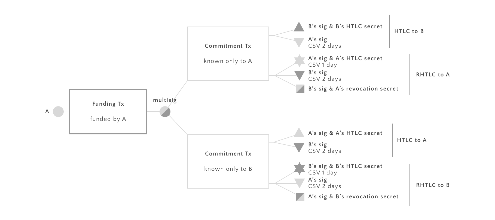

# Yours Payment Channel Hub

We describe how a Bitcoin payment channel hub can be built. The basic building
blocks are 2-way *hash time locked contracts* (HTLCs). Our construction is not
subject to transaction malleability and uses only CHECKSEQUENCEVERIFY (CSV) and
opcodes that are active in Bitcoin script today.

## Smart contracts

We will need two kinds of smart contracts: HTLCs and revokable HTLCs.

### Hash Time Lock Contracts (HTLCs)

A HTLC between Alice (A) and Bob (B) expresses the following:

> An output can be spent by B if he can present a secret within two days, or by
> A after that.

HTLCs make payments routed through several untrusted third parties secure. They
can be encoded by the following output script:

```
IF
  <B's pubkey> CHECKSIG
  HASH160 <Hash160 (secret)> EQUAL
ELSE
  <A's pubkey> CHECKSIG
  <2 days> CHECKSEQUENCEVERIFY
ENDIF
```

If the transaction is settled, Bob may spend the output with the following
input script:

```
<secret> <B's signature> TRUE
```

Alice can spend it after two days with this input script:

```
<A's signature> FALSE
```

### Revocable HTLCs (RHTLCs)

In order for channels to remain open an unlimited amount of time, the parties
must be able to revoke previously made payments. A Revocable Sequence Maturity
Contract (RSMC) is a technique to achieve just that [1]. We apply this
technique to HTLCs in order to make them revokable.

A revocable HTLC (RHTLC) between A and B is a smart contract that expresses:

> An output can be spent by B if he knows A's revocation secret, or after one
> day if B knows the HTLC secret, or by A after 2 days.

The trick is that if Alice gives Bob her revocation secret, then Bob knows that
she will never publish the contract. If she did, he could spend from it
immediately. In this way Alice can effectively revoke the contract. If Bob does
not know the revocation secret, the above condition is equivalent to a normal
HTLC.

In Bitcoin script the condition above can be expressed as follows:

```
IF
  <B's pubkey> CHECKSIGVERIFY
  HASH160 <Hash160 (A's revocation secret)> EQUAL
ELSE
  IF
    <1 day> CHECKSEQUENCEVERIFY DROP
    <B's pubkey> CHECKSIGVERIFY
    HASH160 <Hash160 (HTLC secret)> EQUAL
  ELSE
    <2 days> CHECKSEQUENCEVERIFY DROP
    <A's pubkey> CHECKSIG
  ENDIF
ENDIF
```

If the transaction is settled, Bob may spend the output immediately with the
following input script:

```
<A's revocation secret> <B's signature> TRUE
```

Bob may spend it after one day with the following input script:

```
<HTLC secret> <B's signature> TRUE FALSE
```

Alice may spend it after two days with the following input script:

```
<A's signature> FALSE FALSE
```

## Transactions

For each transaction, Alice (A) and Bob (B) both generate a fresh htcl secret and a fresh revocation secret. They construct the following two transactions:



Each commitment transaction maintains two HTLCs, one for each direction. Note
that each party can revoke their own HTLC but not the other party's.

## Data structures

Either party in the channel stores the following data:
* the source address used to fund the funding transaction
* the multisig address "between" the funding and commitment tx
* the destination address that the commitment transactions spend to
* the funding transaction
* a list of commitment transaction objects
* a reference to the other agent public information (including her list of previous commitment transaction objects)

A commitment transaction object contains the following

* a commitment transaction
* a htlc secret
* a revocation secret

## Protocols

We now describe the protocol that the parties use to construct the transactions shown above.

### Opening the channel

As there are inherent malleability problems if two parties fund a payment
channel. To avoid this problem we use a version where only Alice funds the channel.

**0. Local initialization.** Both agents initialize their local addresses (source, destination) and their initial htlc and revocation secret (asyncInitialize() in agent.js).

**1. Alice and Bob exchange their public projections.** This allows them to build a shared multisig address.

**2. Alice builds a funding transaction.** The party that funds the channel (Alice) creates the funding transaction that
spends to the shared multisig address. She does not broadcast it yet. She then
sends the funding amount and funding transaction hash to Bob.

**3. Bob builds and signs a refund transaction, sends it to Alice.** Alice and
Bob go through the protocol described below for creating a payment, in the case
where Bob sends a payment to Alice. The payment spends all funds from the
funding transaction to Alice.

**4. Alice broadcasts the funding transaction.** When the refund transaction is
created and distributed between the two parties, Alice broadcasts the funding
transaction. The channel is open when the funding transaction is confirmed into
the blockchain.

Note that when the first "real" payment is sent, the refund transaction is
invalidated as described in the section below.

### Creating the payment

We describe a payment from Alice to Bob. Note that if this is not the first
payment, Alice has the following information from the previous payment: her own
revocation secret, her own HTLC secret, the hash of Bob's last revocation
secret, the hash of Bob's last HTLC secret. If this is the first payment,
revoking isn't necessary and those secrets are not needed.

**1. Alice generates a new revocation secret.** She then sends the hash of the
revocation secret to Bob. She will later use the revocation secret to revoke
the commitment transaction she is in the process of creating when she wants to
make another one after that.

**2. Bob generates a new revocation secret.** He sends its hash to Alice. As
above this will allow Bob to revoke this transaction later.

**2.5. Bob generates a new HTLC secret.** Alice will need to know this secret
to prove that she made the payment. Bob sends the HTLC secret's hash to Alice.

**3. Alice builds a commitment transaction.** Alice builds the transaction
labeled "known only to Bob" above. She uses the hash of the revocation secret
obtained from Bob in step 2 and the hash of the HTLC secret from step 2.5. She
signs the transaction and sends it to Bob.

**4. Bob builds a commitment transaction.** If Bob wants to accept the payment,
he will build the transaction labeled "known only to Alice" above. He uses the
revocation secret obtained from Alice in step 1 and the old HTLC secret from
the previous round. He then signs the transaction and sends it back to Alice.

**5. Alice revokes.** To revoke the previous payment, Alice sends her
revocation secret from the last commitment transaction to Bob.

**6. Bob revokes.** Symmetrically, Bob sends Alice his revocation secret from
the last commitment transaction.

### Closing the channel

Either party can broadcast their most recent commitment transaction to the
blockchain. In this case both parties go through the following protocol

**1. Find the most recent HTLC secret.**

**2. Build a spending transaction.**

**3. Broadcast spending transaction and the most recent commitment transaction.**

The party that broadcasts the commitment transaction must wait for a day to do
that, the other party can do so as soon as possible.

### Enforcing the HTLC

In case one party fails to spend an output by providing the HTLC secret, the other party can spend the HTLC output after 2 days.

**1. Build spending transaction using spending key.**

**3. Broadcast spending transaction and the most recent commitment transaction.**

### React to other agent broadcasting an old commitment transaction

In that case one party broadcasts an old commitment transaction,
the other party goes trough the following:

**1. Find the corresponding HTLC secret.**

**2. Create an output script that spends the HTLC output.**

**3. Find the corresponding revocation secret.**

**4. Create an output script that spends the revocation output.**

**5. Build a transaction that spends both outputs.**

This has to happen within one day, in order to make sure that the revocation
output can be spent.

## Security Properties

In the following we assume that both Alice and Bob are malicious but rational.
That is, they look after their own self interest only and try to steal funds
whenever possible, but they will not harm themselves.

_**Property 1.** Assume that from the last payment, both parties have
transactions as in the picture above. If they execute the protocol "Sending a
payment", then their balance is as specified by the commitment transactions.
Either party can force the other to reveal their HTLC secret within two days._

We check that Property 1 holds true after each step of the protocol.

Steps 1 and 2 are not critical as the only information that gets exchanged are
hashes of revocation secrets that have not been used yet.

After step 3 Bob can sign and broadcast the commitment transaction to the
blockchain. In this case Bob is forced to spend the output labelled "HTLC to
Bob" output within two days while Alice's branch of that output is blocked by a
CSV lock. If he does not, then Alice will spend that output. If Bob spends that
output then he reveals his HTLC secret to Alice.

Step 4 is completely symmetric to step 3. The same reasoning applies.

Note that up to this point, Alice and Bob can still broadcast the commitment
transaction from the last round. This is particularly enticing for the party
that had a higher balance in the last round (essentially the "sender" of this
round). Note that however in that case the receiver will eventually reveal the
secret for the last payment, not the current one. Thus the "sender" cannot
claim to have made the last payment.

Step 5. This is where Alice sends her revocation secret to Bob. This guarantees
to Bob that Alice will not broadcast a previous transaction anymore. To
understand why assume that she would. In this case an old version of the
transaction "known only to Alice" is broadcast to the blockchain. If that
happens, Bob can claim both outputs. He can clearly claim the top output (HTLC
to Bob) by revealing an old HTLC secret. He can also claim the second output
using the Alice's revocation secret (either the one she just revealed or one
revealed in a previous round) and his own private key. Note that if Alice
cheats in this way, she looses not only a payment but the entire amount used to
fund the channel.

Step 6 is symmetric to step 5 and the same reasoning applies.

_**Property 2.** While executing the "funding the channel" protocol as
described above, neither party can steal the other parties funds. This is true
in the presence of transaction malleability._

Again, we check that Property 2 holds true after each step of the protocol.
Step 1 is completely uncritical because only public keys are exchanged and a
new address is created. So is step 2 because Alice does not broadcast the
funding transaction yet. Step 3 is not critical according to Property 1.

Note that as this point Alice could maleate her funding transaction before
she'd broadcast it to the blockchain. However all that would do is to
invalidate her refund transaction which would hurt only herself.

There is still the possibility that Bob controls a node that would maleate the
funding transaction after it is broadcast. However Bob would have to control a
sizable part of the bitcoin network to pull this off consistently (if he
controls n% of the network that would work n% of the time). Essentially, only
mining pool operators would have the resources to pull off that attack
consistently. However, there is very little to win (one funding transaction
worth double digit USD) and very much to loose (the miners in the pool), so we
do not anticipate this attack being a problem in practice.

## Implementation

### Funding the channel

**buildMultisig(pubkey).** Creates a second fresh public key, returns a 2-of-2
multisig address from the two keys.

**buildFundingTx(amount, inputs, outputs).** Creates a transaction that spends
amount from inputs to outputs (outputs will be the multisig address from
above).

**buildRefundTx()** Calls BuildCommitmentTx to create a refund transaction.

### Building a payment

**generateRevocationSecret().** Returns a random string.

**storeRevocationSecret(secret).** Stores the revocation secret of the other
party.

**buildCommitmentTx(amount).** Builds and signs a commitment transaction. Still
needs to be signed by the other party.

**acceptCommitmentTx(txb).** Check if payment should be accepted. If so sign
and return.

## References

[1] [The Bitcoin Lightning Network: Scalable Off-Chain Instant
Payments](http://lightning.network/lightning-network-paper.pdf) by Joseph Poon
and Thaddeus Dryja

[2] [A Fast and Scalable Payment Network with Bitcoin Duplex Micropayment
Channels](http://diyhpl.us/~bryan/papers2/bitcoin/Fast%20and%20scalable%20payment%20network%20with%20Bitcoin%20duplex%20micropayment%20channels.pdf)
by Christian Decker and Roger Wattenhofer

[3] [Reaching the Ground with
Lightning](http://ozlabs.org/~rusty/ln-deploy-draft-01.pdf) by Rusty Russel
