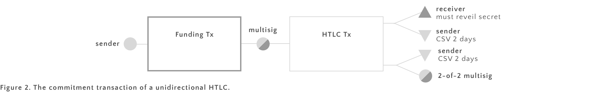

# A Lightning Network for Datt

We describe how a lightning network can be built for the Datt network. Our system will be deployable as soon as the new checksequenceverify (CSV) opcode get's activated in Bitcoin script. It is not subject to transaction malleability.

## 1. Payment channels

Even in a bi-directional channel, there is always a sender who initiates a payment and a receiver. We first describe the data structures used, that is the transactions that each user must know about. We then talk about the functionality that the Wallet must have. Finally, we discuss the protocols used and prove their security.

### 1.1 Uni-directional payment channels

In our use-case however it is important that the channels can remain open an unlimited amount of time. Thus the simples form of payment channels that is based on decreasing time locks. 

We use a slightly more involved construction that is inspired by the Revocable Sequence Maturity Contract (RSMC) of [1]. The transaction that both parties store looks like this. The compicated output to sender is the RSMC, and we will need it to invalidate the funding transaction (explained below).

 

**Setting up the channel.** Receiver sends a public key to sender who will create a public key of his own and create the multisig address that is used as the output of the Funding transaction. Sender then builds and signs, the funding transaction, but does not broadcast it yet. He then builds an initial commitment transaction that spends the entire funding amount back to himself. This transaction will act as a refund for sender to guaraty that receiver cannot take his funding hostage. Sender then signs this transaction who will also sign it and send back the sender. At this point sender can safely broadcast the funding transaction. Once that transaction has one confirmation, the channel is open.

**Sending a payment.** If sender wants to send a payment to receiver, he creates a new commitment transaction with updated output balances and sends it to receiver. Receiver will not send the fully signed transaction back to receiver.

Note that there is a problem here: sender still has that refund transaction set up before. Sender can broadcast that transaction at any point and basically invalidate all payments made through the channel so far. 

Thus we need a way for sender to revoke the funding transaction. That's where the RSMC mentioned above. To invalidate the funding transaction sender simply publishes the key used to generate the multisig output of the funding transaction when he sends the first payment. If he were ever to broadcast afterwards, receiver can claim both outputs of the funding transaction: this is obvious for the first output, not that for the second output he now knows both private keys needed to spend from the multisig output. As receivers output is locked by a CSV lock for some time, he has some time spend the funding transaction after sender broadcasts it.

Note that if Sender tries to cheat by broadcasting the funding transaction he loses not only the funds he has legitimately sent to Receiver, but all also the funds that he has not spent yet.

Note that out construction uses Rusty Russel's trick to avoid transaction malleability: we maintain only one level of transactions on top of the funding transaction [3]. Note that this prevents malleability attacks because the funding transaction is confirmed into the blockchain when payments are made.

### Bi-directional channels

In the bi-directional case, both parties must be able to revoke a transaction. We simply use a RSMC for both outputs:

Whenever someone sends a new commitment to the other party he will use a new key to generate both multisig outputs send the keys used for the last transaction with it (in order to revoke the old transaction). As before, the receiver is not forced to resend the fully signed transaction to sender, but may choose to do so safely.

Note that this case is essentially not more complex than the previous.

## 1.2 HTLC Transactions

Hash time locked contracts (HTLC) guaranty security in a multi-hop scenario. A HTLC encodes the following:

> Receiver can spend an output if he can present a secret within a limited amount of time. If he fails to do so, no payment is made.

This can be encoded by the following output script

	OP_IF
		<Receiver's pubkey> CHECKSIGVERIFY
		OP HASH160 <Hash160 (s)> OP_EQUALVERIFY 
	OP_ELSE
		<2 days> CHECKSEQUENCEVERIFY DROP
		<Sender's pubkey> CHECKSIGVERIFY
	OP_ENDIF
	
### Uni-directional HTLCs

In the one-directional model, we just add the above script to receivers output of the commitment transactions.

Note that the output to receiver encodes the HTLC whereas we use a RSMC to make senders output revokable. Like in the uni-directional payment channel case this is needed so that sender can revoke the payment transaction.

*__Theorem__ If Sender and Receiver set up a HTLC as above, exactly one of the following is true:*

 * *Receiver reveals the secret to Sender within a limited amount of time and Sender sends him the money*
 * *Sender can force a refund after 2 days*

**Proof** We assume that the Funding transaction has been confirmed into the blockchain and both parties have signed and exchanged the HTLC transaction. There are two ways that this can play out: either the two parties decide to cooperate or not. We will see that under the assumptions they will cooperate. To see why, we have to look at what happens if they don't.

In this case eventually one party will broadcast the HTLC transaction to the blockchain and someone spends it. If Receiver does, then he reveals his secret while doing so. If Receiver does not spend, then Sender will be able to spend output after 2 days to refund himself (these two cases are exactly what is enforced by the output of the Setup transaction). In both cases the condition of the Theorem is maintained.

The outcome of not cooperating is not bad for either party, no-one has lost any money. However, it's not awesome either. After all, they are effectively closing the channel when someone broadcasts the HTLC transaction. All else being equal, they prefer to keep the channel open.

We have just argued that no party has anything to gain from not cooperating. So lets see how they can cooperate to avoid having to close channel. The protocol is simple:

> After getting the signed HTLC transaction from Sender, Receiver sends the secret to sender

We have to check that the conditions of the Theorem are maintained afterwards. Receiver waits for Sender to send the payment transaction for one day (this is not enforced by anything, just a convention between the two). If he does not get the payment he assumes that Sender is not willing to cooperate and proceeds to broadcast the HTLC transaction to the blockchain. He then spends its output to himself, thereby revealing the secret. In this case everything played out as in the non-cooperative case. **qed.**

### Bi-directional HTLCs
	
In the bi-directional case the parties need the ability to revoke a HTLC. Luckily we already know how to revoke an output: use an RSMC (quick reminder: a RSMC temporarily locks an output with a CSV lock and make an additional branch with an output that both parties must sign).

Note that this transaction maintains two HTLCs - one for each direction in the channel. When sender wants to force receiver to reveal his secret, he just broadcasts the HTLC transaction to the blockchain. In this case receiver will have to spend his (the top) output between day 1 and day 2. If he waits after day 2 then sender can use his output to spend that output. 

In addition this more complex output allows the the parties to revoke old transactions. Like in the case of payment channels, they use a new key to build each new transaction. Whenever they send a new payment they publish the key used in the last payment in oder to revoke it.

If the reveiver does not know the secret he can 

TODO: what if a party does not know the secret?

## 2. Protocols

### Establishing a channel

**1. Create Multisig.** Sender creates a new public key and sends it to receiver. Receiver then creates a new 2-of-2 multisig address and sends it back to sender

**2. Create Funding Transactions Locally.** Next both parties create a funding transaction that spends to the newly created multisig. They do not broadcast or exchange these transactions.

**3. Create Refund Transactions.** Each party builds a transaction that spends their input into the multisig address back to an address that they controll. They do not sign it. They ask the other party sign it and send it back. 

**4. Broadcast Funding Transactions.** Once both parties have gotten their refund transactions, they fund they broadcast their funding transaction.

### Sending a paymnet

**1. Building the multisig outputs.** Sender creates two public keys, sends them to receiver. Receiver creates two public keys of his own, sends them to sender. Sender created two multisig addresses.

**2. Sender builds, signes, & sends HTLC tx.** Sender builds a HTLC transaction from the new addresses, signes it, and sends to receiver.

Note that it is not necessary for receiver to resend the signed tx to sender. If sender wants to revoke that transaction, he just publishes the private keys he used to build the multisig addresses.

### Maintaining several secrets

The construction above can maintain several secrets for each direction. To do so it just adds an extra output per secret.

### Resolving HTLC off-blockchain

Note that sender will not be able to send a new payment until the HTLC contract is resolved. Thus receiver is motivated to resolve off-chain. 

To do that receiver sends the secret to sender. Sender will then construct a new commitment transaction with that output downgraded from a HTLC output to a payment channel output.

### Closing the channel

Either party can to that unilaterally. If the two parties collaborate they can create a smaller transaction where outputs are merged.

## Implementation

There are two files, one for sender and one for receiver.

### Sender

A sender has the following functions

#### Channel creation
**CreateFundingTransaction(amount, multisigAddress)** Creates a signed transaction spending to the multisig address

**CreateRefundTransaction(amount, multisigAddress)** Creates a partially signed refund transaction.

### Receiver

A receiver has the following functions

#### Channel creation
**SignRefundTransaction(txb)** Signes a partially signed refund transaction

## References 

[1] [The Bitcoin Lightning Network:
Scalable Off-Chain Instant Payments](http://lightning.network/lightning-network-paper.pdf) by Joseph Poon and Thaddeus Dryja

[2] [A Fast and Scalable Payment Network with
Bitcoin Duplex Micropayment Channels](http://diyhpl.us/~bryan/papers2/bitcoin/Fast%20and%20scalable%20payment%20network%20with%20Bitcoin%20duplex%20micropayment%20channels.pdf) by Christian Decker and Roger Wattenhofer

[3] [Reaching the Ground with Lighning](http://diyhpl.us/~bryan/papers2/bitcoin/Fast%20and%20scalable%20payment%20network%20with%20Bitcoin%20duplex%20micropayment%20channels.pdf) by Rusty Russel
